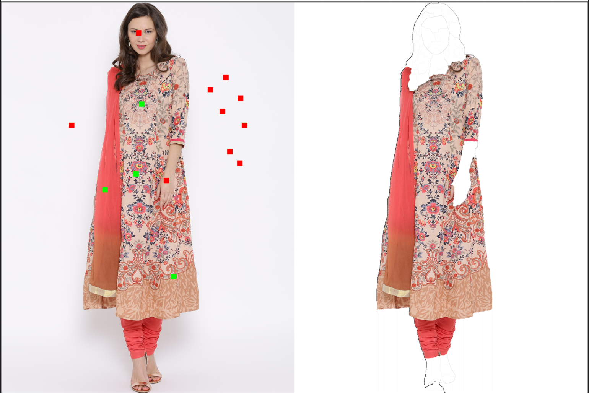

# Multi-Scale Combinatorial Grouping for Cloth Annotation
Create Segmentation annotation on your apparel with a few clicks

## Installation Instructions

1. Establish a conda virtual environment and activate it-
   - ```conda env create -f environment.yml```
   - ```conda activate img_syn```
2. Load the Jupyter notebook and run it -
   - The notebook for the MCG code is present in the notebooks directory
   - Run ```jupyter notebook``` to fire up the explorer

## Result
